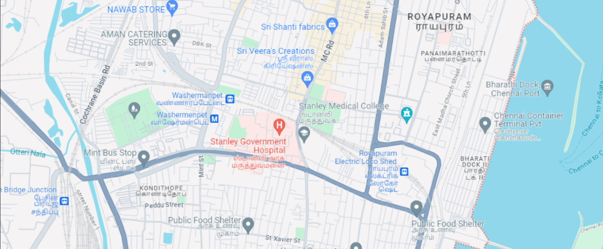
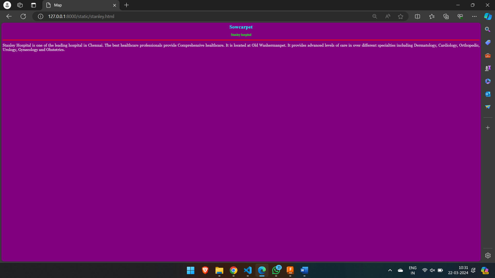
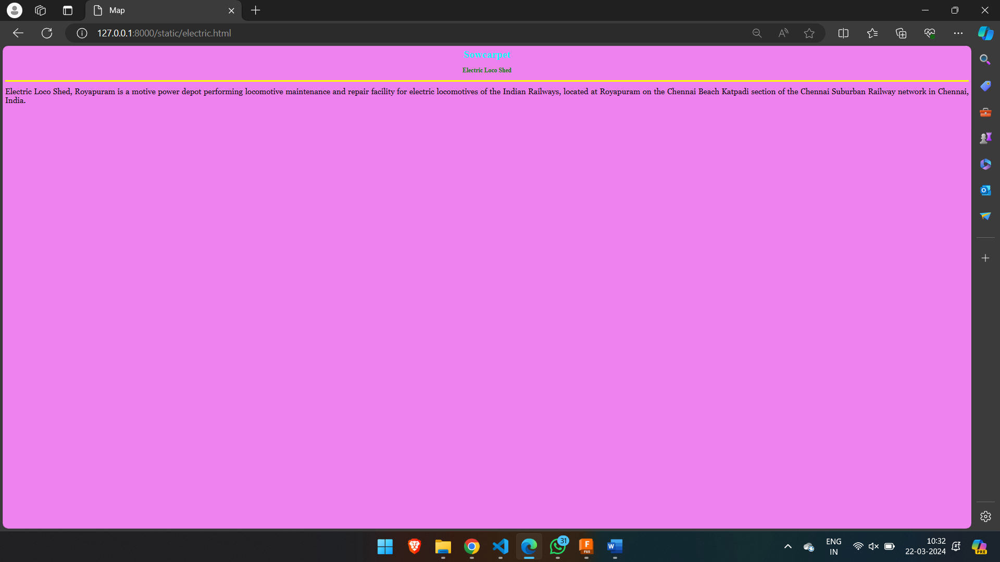
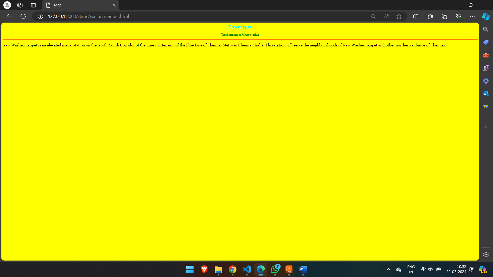
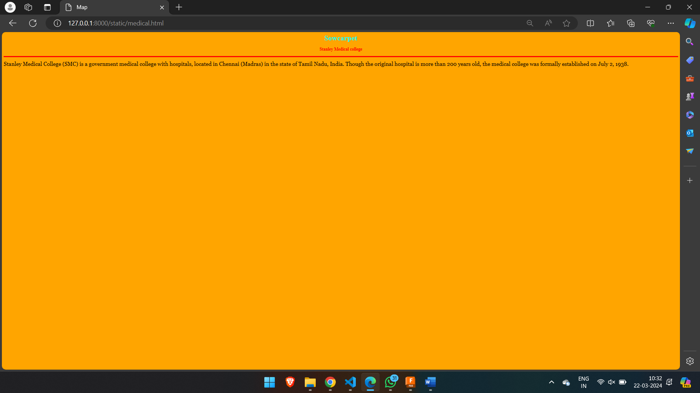
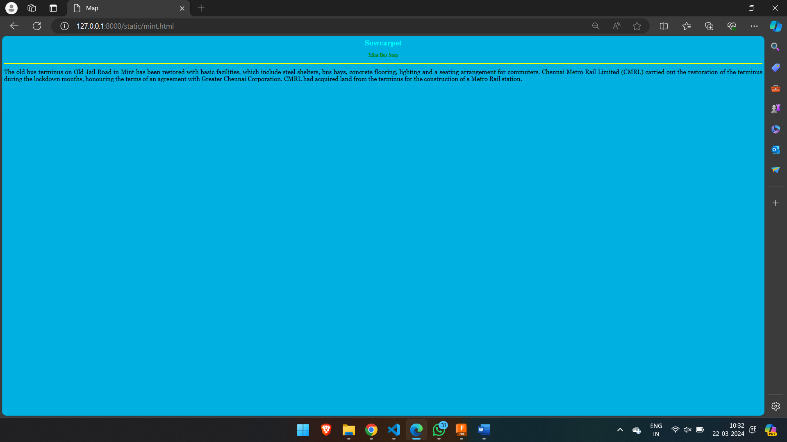

# Ex04 Places Around Me
## Date: 22/03/2024

## AIM
To develop a website to display details about the places around my house.

## DESIGN STEPS

### STEP 1
Create a Django admin interface.

### STEP 2
Download your city map from Google.

### STEP 3
Using ```<map>``` tag name the map.

### STEP 4
Create clickable regions in the image using ```<area>``` tag.

### STEP 5
Write HTML programs for all the regions identified.

### STEP 6
Execute the programs and publish them.

## CODE

```
sam.html

<html>
    <head>
        <title>Map</title>
    </head>
    <body>
        <h1 align="center">
            <font color="red"><b>Sowcarpet</b></font>
        </h1>
        <h3 align="center">
            <font color="blue"><b>Samakash(212223230182)</b></font>
        </h3>
        <center>
            
            <map name="image-map">
            <area target="" alt="hospital" title="hospital" href="stanley.html" coords="698,365,913,496" shape="rect">
            <area target="" alt="Bus stop" title="Bus stop" href="mint.html" coords="376,477,110" shape="circle">
            <area target="" alt="college" title="college" href="medical.html" coords="927,308,1094,462" shape="rect">
            <area target="" alt="metro station" title="metro station" href="washermanpet.html" coords="610,349,84" shape="circle">
            <area target="" alt="loco shed" title="loco shed" href="electric.html" coords="1048,614,1307,464" shape="rect">
            <area target="" alt="" title="" href="" coords="" shape="0">
            </map>
        </center>  
    </body>
</html>

stanley.html

<html>
    <head>
        <title>Map</title>
    </head>
    <body bgcolor="purple">
        <h1 align="center">
            <font color="cyan"><b>Sowcarpet</b></font>
        </h1>
        <h3 align="center">
            <font color="lime"><b>Stanley hospital</b></font>
        </h3>
        <hr size="3" color="red">
        <p align="justify">
            <font face="Georgia" size="5" color="white">
                Stanley Hospital is one of the leading hospital in Chennai. 
                The best healthcare professionals provide Comprehensive healthcare. 
                It is located at Old Washermanpet. 
                It provides advanced levels of care in over different specialties including Dermatology, Cardiology, Orthopedic, Urology, Gynecology and Obstetrics.
            </font>
        </p>
    </body>
</html>

electric.html

<html>
    <head>
        <title>Map</title>
    </head>
    <body bgcolor="violet">
        <h1 align="center">
            <font color="cyan"><b>Sowcarpet</b></font>
        </h1>
        <h3 align="center">
            <font color="green"><b>Electric Loco Shed</b></font>
        </h3>
        <hr size="3" color="yellow">
        <p align="justify">
            <font face="Georgia" size="5" color="black">
                Electric Loco Shed, Royapuram is a motive power depot performing locomotive maintenance and repair facility for electric locomotives of the Indian Railways, 
                located at Royapuram on the Chennai Beach Katpadi section of the Chennai Suburban Railway network in Chennai, India.
            </font>
        </p>
    </body>
</html>

washermanpet.html

<html>
    <head>
        <title>Map</title>
    </head>
    <body bgcolor="yellow">
        <h1 align="center">
            <font color="cyan"><b>Sowcarpet</b></font>
        </h1>
        <h3 align="center">
            <font color="green"><b>Washermanpet Metro station</b></font>
        </h3>
        <hr size="3" color="red">
        <p align="justify">
            <font face="Georgia" size="5" color="black">
                New Washermanpet is an elevated metro station on the North-South Corridor of the Line 1 Extension of the Blue Line of Chennai Metro in Chennai, India. 
                This station will serve the neighbourhoods of New Washermanpet and other northern suburbs of Chennai.
            </font>
        </p>
    </body>
</html>

medical.html

<html>
    <head>
        <title>Map</title>
    </head>
    <body bgcolor="orange">
        <h1 align="center">
            <font color="cyan"><b>Sowcarpet</b></font>
        </h1>
        <h3 align="center">
            <font color="red"><b>Stanley Medical college</b></font>
        </h3>
        <hr size="3" color="red">
        <p align="justify">
            <font face="Georgia" size="5" color="black">
                Stanley Medical College (SMC) is a government medical college with hospitals, located in Chennai (Madras) in the state of Tamil Nadu, India. 
                Though the original hospital is more than 200 years old, the medical college was formally established on July 2, 1938.
            </font>
        </p>
    </body>
</html>

mint.html

<html>
    <head>
        <title>Map</title>
    </head>
    <body bgcolor="sky blue">
        <h1 align="center">
            <font color="cyan"><b>Sowcarpet</b></font>
        </h1>
        <h3 align="center">
            <font color="green"><b>Mint Bus Stop</b></font>
        </h3>
        <hr size="3" color="yellow">
        <p align="justify">
            <font face="Georgia" size="5" color="black">
                The old bus terminus on Old Jail Road in Mint has been restored with basic facilities, which include steel shelters, bus bays, concrete flooring, lighting and a seating arrangement for commuters.
                Chennai Metro Rail Limited (CMRL) carried out the restoration of the terminus during the lockdown months, honouring the terms of an agreement with Greater Chennai Corporation. 
                CMRL had acquired land from the terminus for the construction of a Metro Rail station.
            </font>
        </p>
    </body>
</html>

```

## OUTPUT







## RESULT
The program for implementing image maps using HTML is executed successfully.
